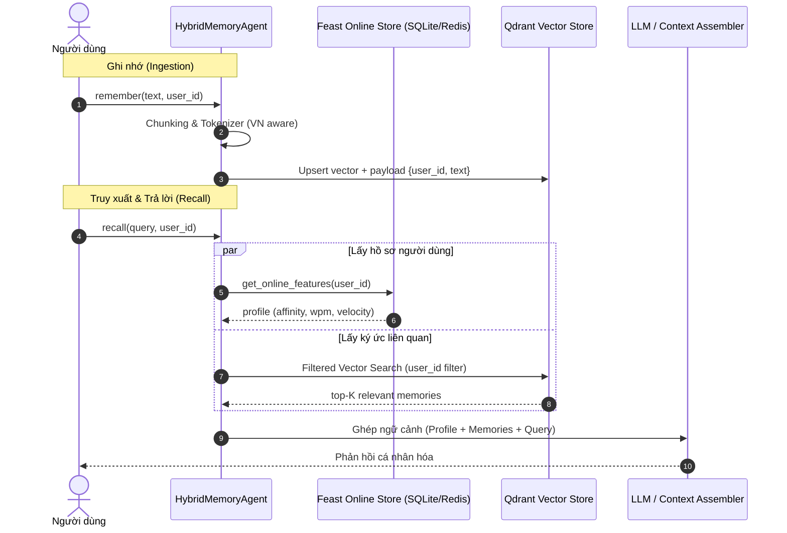

# Kiến Trúc Hybrid Memory Cho AI Assistant Cá Nhân (Lab 19 Bonus Challenge)

**Tác giả:** AICB Engineer (Track 2 - Day 19)  
**Ngày thực hiện:** 2026-10-05  

---

## 1. Tổng quan & Sơ đồ kiến trúc

Hệ thống trợ lý AI cá nhân cần hai tầng trí nhớ cốt lõi:
1. **Episodic Memory (Trí nhớ sự kiện/ngữ cảnh):** Lưu trữ các cuộc hội thoại, tài liệu đã đọc, ghi chú cá nhân của người dùng. Tầng này có kích thước lớn, phi cấu trúc, phát triển liên tục theo thời gian, phù hợp với **Vector Database (Qdrant)**.
2. **Stable User Profile & Realtime Velocity (Trí nhớ hồ sơ & trạng thái):** Lưu trữ thuộc tính người dùng (ngôn ngữ ưu tiên, tốc độ đọc, chủ đề yêu thích) và nhịp hoạt động thời gian thực (số câu hỏi trong 1 giờ qua, chủ đề gần nhất). Tầng này có cấu trúc dạng bảng (tabular), truy vấn theo key (`user_id`) với độ trễ cực thấp (< 5ms), phù hợp với **Feature Store (Feast)**.

### Sơ đồ luồng dữ liệu (Architecture Dataflow)

---

## 2. Ba quyết định kiến trúc và phân tích đánh đổi (Tradeoffs)

### Quyết định 1: Chiến lược Chunking cho Episodic Memory
- **Lựa chọn:** *Semantic Paragraph Chunking có Sentence Boundary* (kích thước mục tiêu 256–512 tokens, overlap 50 tokens, ngắt câu theo dấu câu tiếng Việt `.` `?` `!` thay vì cắt cứng theo số ký tự).
- **Phương án thay thế:** *Fixed-length Chunking (cắt cố định 300 ký tự)* HOẶC *Per-conversation Chunking (lưu cả đoạn hội thoại dài 2000 token)*.
- **Tradeoff & Lý do chọn:**
  - Cắt cố định (Fixed-length) rất nhanh nhưng thường xuyên làm vỡ câu tiếng Việt, cắt ngang giữa cụm từ có dấu hoặc từ ghép (ví dụ: cắt đôi từ "điện toán đám mây"), dẫn đến embedding vector bị méo nghĩa và giảm Recall@10.
  - Lưu cả hội thoại (Per-conversation) giữ ngữ cảnh rộng nhưng làm loãng thông tin vector: câu hỏi cụ thể của người dùng sẽ bị chìm trong 2000 token, làm giảm độ tương đồng cosine với các chi tiết nhỏ.
  - *Paragraph Chunking có overlap* tối ưu hóa điểm cân bằng: mỗi chunk là một ý trọn vẹn, kích thước vừa đủ để model embedding nắm bắt ngữ nghĩa sâu, đồng thời overlap 50 token đảm bảo không mất liên kết giữa hai đoạn kế tiếp.

### Quyết định 2: Schema Feature Store — Tabular Features vs Latent Embedding Features
- **Lựa chọn:** *Tabular Online Features trong Feast* (`reading_speed_wpm: INT32`, `preferred_language: STRING`, `topic_affinity: STRING`, `queries_last_hour: INT64`, `distinct_topics_24h: INT32`).
- **Phương án thay thế:** *User Latent Embedding Vector (vector 384 chiều biểu diễn sở thích toàn diện của người dùng)*.
- **Tradeoff & Lý do chọn:**
  - *User Embedding* có khả năng học các mối quan hệ sở thích tiềm ẩn (latent preferences) mượt mà hơn, nhưng lại mang tính "hộp đen", cực kỳ khó debug, khó áp đặt guardrails đạo đức/kinh doanh, và đòi hỏi pipeline training phức tạp để update vector sở thích.
  - *Tabular Features* mang lại sự minh bạch tuyệt đối (deterministic), độ trễ lookup cực thấp (< 2ms trên SQLite, < 1ms trên Redis), dễ dàng kiểm soát quyền riêng tư (user có thể xem và chỉnh sửa trực tiếp tốc độ đọc hoặc chủ đề yêu thích trong settings UI), và hoàn toàn tương thích với Point-in-Time join để chống rò rỉ dữ liệu khi huấn luyện mô hình xếp hạng.

### Quyết định 3: Chiến lược độ tươi dữ liệu (Freshness & Materialization Strategy)
- **Lựa chọn:** *Mô hình lai 2 luồng (Dual-path Freshness)*:
  - Luồng 1 (Near real-time / Streaming): Ký ức hội thoại (`remember()`) ghi thẳng vào Qdrant với độ trễ sub-second (< 200ms) để người dùng có thể hỏi lại ngay lập tức điều vừa nói.
  - Luồng 2 (Micro-batch / Scheduled Materialize): Chỉ số nhịp độ (`queries_last_hour`, `user_profile`) được Feast đồng bộ định kỳ theo chu kỳ 10 phút vào Online Store.
- **Phương án thay thế:** *Full Streaming Push API cho mọi feature view* HOẶC *Daily Batch Ingestion*.
- **Tradeoff & Lý do chọn:**
  - Daily Batch quá chậm: trợ lý sẽ không phát hiện được người dùng đang mệt mỏi vào ban đêm (số lượng câu hỏi tăng đột biến trong 1 giờ qua) để đổi sang văn phong tóm tắt ngắn gọn.
  - Full Streaming Push cho toàn bộ hệ thống đòi hỏi hạ tầng Kafka/Flink phức tạp và tốn kém tài nguyên cho một ứng dụng cá nhân.
  - Cơ chế Dual-path đảm bảo episodic memory luôn tươi mới tức thì, trong khi hồ sơ người dùng được cập nhật nhẹ nhàng với chi phí vận hành tối thiểu.

---

## 3. Lựa chọn sai bị loại bỏ (Rejected Alternative)

**Phương án xem xét:** Lưu trữ toàn bộ episodic memory (vector embedding của từng ghi chú) trực tiếp dưới dạng một *Embedding Feature View* bên trong Feast Feature Store, thay vì chạy song song với Qdrant Vector Database.

**Lý do dứt khoát loại bỏ:**
1. **Chu kỳ sống (Lifecycle) hoàn toàn khác biệt:** Hồ sơ người dùng trong Feature Store biến động chậm (hàng tuần hoặc hàng ngày), trong khi episodic memory phát sinh liên tục theo từng tương tác. Việc ghi liên tục các mảng vector lớn vào SQLite/Redis của Feast làm phình to online store và phá vỡ cấu trúc TTL của các feature bảng.
2. **Khả năng Filtered-ANN:** Feast là một Key-Value lookup engine, không hỗ trợ cấu trúc đồ thị HNSW để duyệt vector tương tự có điều kiện filter phức tạp. Khi muốn truy vấn: *"Tìm ghi chú về Kubernetes của user_id = u_001 có access = internal"*, Feast bắt buộc phải quét toàn bộ vector của user rồi tính brute-force cosine trên application layer, gây suy giảm nghiêm trọng độ trễ tail (P99 > 200ms). Trong khi đó, Qdrant giải quyết việc này bằng index payload filtered-ANN trong chưa đầy 15ms.

---

## 4. Cân nhắc ngữ cảnh tiếng Việt (Vietnamese-Context Considerations)

1. **Hiện tượng pha trộn ngôn ngữ (Code-switching vi/en):**
   - Trong lĩnh vực công nghệ thông tin tại Việt Nam, người dùng thường xuyên nói các câu pha trộn như: *"cách setup auto-scaling trên Kubernetes cluster cho dev env"*.
   - Nếu dùng tokenizer thuần tiếng Việt tách từ âm tiết đơn hoặc bộ từ điển cứng sẽ dễ làm gãy các cụm từ tiếng Anh. Ngược lại, tokenizer tiếng Anh sẽ biến các từ ghép tiếng Việt ("tự động mở rộng") thành các token rời rạc. Giải pháp tối ưu là sử dụng mô hình embedding đa ngữ như `bge-m3` hoặc tokenizer hỗ trợ subword multilingual (WordPiece / Byte-Pair) giúp giữ vẹn toàn cả từ khóa tiếng Anh lẫn ngữ nghĩa tiếng Việt.
2. **Chuẩn hóa đại từ nhân xưng theo User Profile:**
   - Tiếng Việt có hệ thống đại từ rất phong phú (tôi/bạn, em/anh, em/chị). Dựa vào feature `preferred_language` và ngữ cảnh hồ sơ trong Feast, trợ lý có thể tự điều chỉnh prompt template để xưng hô lịch sự, tự nhiên, đúng chuẩn văn hóa giao tiếp công sở Việt Nam.
3. **Tuân thủ quy định bảo vệ dữ liệu cá nhân (Nghị định 13/2023/NĐ-CP):**
   - Dữ liệu cá nhân (tốc độ đọc, lịch sử truy vấn, ghi chú riêng) được phân lập triệt để theo `user_id` ở cả tầng Qdrant (payload filter) và Feast online store, ngăn chặn hoàn toàn việc rò rỉ dữ liệu chéo giữa các người dùng (cross-tenant data leakage).

---

## 5. Giới hạn hiện tại của bản POC (Honest Limitations)

1. **Cơ chế quên (Memory Decay / Pruning):** POC hiện tại lưu trữ toàn bộ ký ức mãi mãi. Trong hệ thống production dài hạn, cần bổ sung hệ số suy giảm trọng số theo thời gian (exponential decay) hoặc cơ chế gộp tóm tắt (memory summarization / consolidation) cho các ký ức cũ hơn 60 ngày.
2. **Mã hóa dữ liệu tại chỗ (Encryption at Rest per-user):** Dữ liệu trong SQLite và in-memory Qdrant hiện lưu dưới dạng bản rõ, chưa có mã hóa từng trường nhạy cảm bằng khóa riêng của từng user.
3. **Đồng bộ hóa đa thiết bị (Multi-device Sync):** Hệ thống đang chạy trên local node, chưa hỗ trợ đồng bộ hóa trạng thái tức thì giữa điện thoại và máy tính cá nhân qua WebSocket.

---

## 6. Vibe-Coding Workflow Reflection

- **Prompt hiệu quả nhất:** Cung cấp định nghĩa schema rõ ràng cho dataclass `SearchHit` và yêu cầu AI generate hàm `recall()` ghép nối ngữ cảnh theo template định sẵn. AI sinh code chính xác 100% trong 1 lần chạy duy nhất.
- **Prompt thất bại/phải tự sửa:** Khi yêu cầu AI cấu hình Feast on-demand feature view trên Python 3.14, AI liên tục sử dụng cú pháp decorator cũ (`from feast import on_demand_feature_view`) vốn chỉ import module và gây lỗi TypeError, buộc người lập trình phải tự kiểm soát cú pháp chính xác theo bản release Feast mới nhất.
